# Public

Modul Public adalah lapisan CMS (Content Management System) yang menyajikan tampilan portal publik perguruan tinggi dan halaman landing page. Modul ini mengelola konten editorial (halaman statis, pengumuman, FAQ, slideshow, testimonial, partner/klien), blok layout landing page (hero, fitur, produk, statistik, CTA), konfigurasi metadata situs, dan struktur menu navigasi publik. Seluruh tabel menggunakan prefix `cms_` dan bersifat multi-tenant melalui kolom `tenant_id`.

Modul Public tidak menjalankan logika bisnis inti sistem akademik; fungsinya adalah permukaan komunikasi keluar (halaman marketing, profil prodi, berita, dan pengumuman resmi) yang dapat dikelola oleh admin humas/konten tanpa menyentuh modul akademik.

## Daftar Tabel

| #  | Tabel                        | Deskripsi Singkat                                                                  |
|----|------------------------------|------------------------------------------------------------------------------------|
| 1  | `cms_page`                   | Halaman statis/profil prodi yang dapat ditautkan dari menu.                        |
| 2  | `cms_menu`                   | Item menu navigasi (header/footer) dengan struktur hierarkis dan target tautan.   |
| 3  | `cms_pengumuman`             | Pengumuman resmi perguruan tinggi, lengkap dengan penulis dan status publikasi.   |
| 4  | `cms_slideshow`              | Banner slideshow berurutan untuk halaman beranda.                                  |
| 5  | `cms_faq`                    | Pertanyaan umum (FAQ) yang ditampilkan di halaman publik.                         |
| 6  | `cms_testimonial`            | Testimoni pengguna/mitra dengan rating dan urutan tampil.                          |
| 7  | `cms_partner`                | Daftar mitra/lembaga kerja sama yang ditampilkan di halaman publik.                |
| 8  | `cms_hero_sections`          | Blok hero utama pada landing page (judul, subjudul, tombol CTA).                   |
| 9  | `cms_features`               | Daftar fitur/keunggulan pada landing page.                                         |
| 10 | `cms_products`               | Daftar produk/layanan yang dipromosikan pada landing page.                         |
| 11 | `cms_statistics`             | Statistik numerik prestatif pada landing page (akreditasi, mahasiswa, dll).        |
| 12 | `cms_clients`                | Daftar klien/kustomer yang ditampilkan pada landing page.                          |
| 13 | `cms_ctas`                   | Blok Call-To-Action tambahan pada landing page.                                    |
| 14 | `cms_landing_page_settings`  | Pengaturan global landing page per tenant (judul situs, kontak, sosial media).     |
| 15 | `cms_landing_sections`       | Orkestrasi section landing page (area, komponen, urutan, settings JSON).           |

## Entity Relationship Diagram

```mermaid
erDiagram
    cms_page ||--o{ cms_menu : "linked by page_id"
    cms_menu ||--o{ cms_menu : "self parent_id"
    cms_page {
        bigint page_id PK
        string slug
        string title
        longText content
        boolean is_published
    }
    cms_menu {
        bigint menu_id PK
        bigint parent_id FK
        bigint page_id FK
        string type
        string position
        string target
        int sequence
        boolean is_active
    }
    cms_pengumuman {
        bigint pengumuman_id PK
        bigint penulis_id FK
        string judul
        text isi
        string jenis
        boolean is_published
        timestamp published_at
    }
    cms_slideshow {
        bigint id PK
        string image_url
        string title
        int seq
        boolean is_active
    }
    cms_faq {
        bigint faq_id PK
        string question
        text answer
        string category
        int seq
        boolean is_active
    }
    cms_testimonial {
        bigint testimonial_id PK
        string name
        string position
        text quote
        tinyint rating
        int seq
        boolean is_active
    }
    cms_partner {
        bigint partner_id PK
        string name
        string category
        string website_url
        int seq
        boolean is_active
    }
    cms_hero_sections {
        bigint hero_id PK
        string title
        string subtitle
        text description
        boolean is_active
    }
    cms_features {
        bigint feature_id PK
        string title
        text description
        string icon
        int sort_order
        boolean is_active
    }
    cms_products {
        bigint product_id PK
        string name
        string slug
        text description
        int sort_order
        boolean is_active
    }
    cms_statistics {
        bigint statistic_id PK
        string label
        string value
        string icon
        int sort_order
        boolean is_active
    }
    cms_clients {
        bigint client_id PK
        string name
        string website
        int sort_order
        boolean is_active
    }
    cms_ctas {
        bigint cta_id PK
        string title
        text description
        string button_text
        string button_link
        boolean is_active
    }
    cms_landing_page_settings {
        bigint id PK
        bigint tenant_id
        string site_title
        string contact_email
        text address
    }
    cms_landing_sections {
        bigint landing_section_id PK
        string section_key
        string area
        string component_name
        string variant
        int sort_order
        boolean is_active
        json settings
    }
```



## Template Landing Page

Modul Public menggunakan **Inertia.js + React** untuk merender landing page publik. Terdapat 8 template dengan palet, tipografi, dan tata letak yang berbeda. Masing-masing template mengimplementasikan section yang sama (hero, feature, product, statistic, client, testimonial, pengumuman, faq, cta) dengan interpretasi visual yang unik.

### Daftar Template

| #  | Key            | File                              | Palet Utama          | Karakter                        | Cocok Untuk                            |
|----|----------------|-----------------------------------|----------------------|---------------------------------|----------------------------------------|
| 1  | `modern`       | `ModernTemplate.jsx`              | Biru (#1d4ed8)      | Startup tech, browser mockup    | Teknologi, startup kampus              |
| 2  | `editorial`    | `EditorialTemplate.jsx`           | Oranye (#b34719)    | Serif, warm, editorial          | Publikasi, portal berita               |
| 3  | `corporate`    | `CorporateTemplate.jsx`           | Navy/emas           | Grid lines, structured          | Institusi formal, pemerintahan         |
| 4  | `launch`       | `LaunchTemplate.jsx`              | Biru (#1e40af)      | Dark gradient, product launch   | Peluncuran produk, event               |
| 5  | `aurora`       | `AuroraTemplate.jsx`              | Cyan/glassmorphism  | Dark/light, artistik            | Kreatif, desain, portofolio            |
| 6  | `enterprise`   | `EnterpriseTemplate.jsx`          | Biru (#2563eb)      | Clean monochrome, minimal SaaS  | Enterprise SaaS, B2B, company profile  |
| 7  | `registration` | `RegistrationTemplate.jsx`        | Emerald (#059669)   | Form-centric, warm              | Pendaftaran, admissions, program       |
| 8  | `profile`      | `ProfileTemplate.jsx`             | Slate (#1e293b)     | Elegant editorial, serif        | Company profile, professional services |
| 9  | `campus`       | `CampusTemplate.jsx`              | Teal (#0d766e)      | Akademik, hero foto + stats     | Beranda kampus, universitas            |
| 10 | `admissions`   | `AdmissionsTemplate.jsx`          | Maroon (#9f1239)    | Pendaftaran, alur langkah       | PMB, pendaftaran mahasiswa             |
| 11 | `tracer`       | `TracerTemplate.jsx`              | Navy (#1e3a8a)      | Dashboard data, alumni          | Tracer study, jejak alumni             |

### Arsitektur Template

```
Template menerima 1 prop: data (dari Inertia usePage().props)
  └── data.sections[]   → urutan & aktivasi section dari CMS
  └── data.landing      → hero, features, products, statistics, clients, CTA
  └── data.site         → nama, logo, kontak, sosial media
  └── data.menus        → navigasi header
  └── data.pages        → halaman statis
  └── data.announcements → pengumuman/berita
  └── data.partners     → mitra/klien
  └── data.testimonials → testimoni
  └── data.faqs         → FAQ
  └── data.template     → key template aktif
```

Setiap template adalah **satu file JSX default export** di `resources/assets/js/templates/`. Template **wajib** menghormati `section.is_active` — jika `false`, section tidak dirender.

### Registrasi Template

| Langkah | File |
|---------|------|
| Daftarkan di konstanta | `app/Services/LandingPageService.php` → `TEMPLATES` array |
| Import & mapping | `resources/assets/js/pages/Home.jsx` → `templates` object |
| Label preview | `resources/assets/js/layouts/PublicLayout.jsx` → `TemplatePicker` labels |
| CSS tema | `resources/assets/css/landing.css` → `.theme-{key}` block |

### Mekanisme Tema CSS

Class tema (`theme-{key}`) di-apply oleh `PublicLayout.jsx` di wrapper div utama. Setiap tema mendefinisikan CSS custom properties:

```css
.theme-enterprise {
    --primary: #2563eb;
    --primary-dark: #1d4ed8;
    --foreground: #0f172a;
    --background: #ffffff;
    --card: #ffffff;
    --border: #e2e8f0;
    --muted: #64748b;
    --section-tint: #f8fafc;
}
```

Kelas komponen (`.ui-button`, `.ui-badge`, `.spotlight-card`, `.section--tint`, `.section--dark`) di-override per tema untuk konsistensi visual.

## Relasi ke Modul Lain

- `cms_pengumuman.penulis_id` → `users.id` (Account)
- `cms_menu.page_id` → `cms_page.page_id` (internal modul ini, dengan `nullOnDelete` agar halaman yang dihapus tidak menghapus menu)
- `cms_menu.parent_id` → `cms_menu.menu_id` (self-reference untuk struktur pohon menu)
- Seluruh tabel memuat `tenant_id` untuk isolasi multi-tenant (modul Sys/Saas)
- Field blameable `created_by`/`updated_by`/`deleted_by` menyimpan identifier user (Account) yang melakukan aksi

## Catatan Domain

- `cms_menu.type` menggunakan nilai `link` (URL eksternal/manual), `page` (tautan internal ke `cms_page.page_id`), atau `route` (nama route Laravel).
- `cms_menu.position` menyimpan lokasi penempatan menu, utamanya `header` dan `footer` (dapat diperluas: `sidebar`, dll).
- `cms_menu.target` mengikuti konvensi HTML: `_self` (default) atau `_blank` untuk membuka tab baru.
- `cms_landing_sections.area` menandakan area render: `header`, `content`, atau `footer`; setiap section dikunci unik per tenant melalui `unique(tenant_id, section_key)`.
- `cms_landing_page_settings` menerapkan `unique(tenant_id)` sehingga satu tenant hanya memiliki satu baris konfigurasi global landing page.
- `cms_products` menerapkan `unique(tenant_id, slug)` agar slug produk unik dalam scope tenant.
- `cms_page.slug` bersifat global-unique (tanpa scope tenant) untuk menjamin URL halaman publik stabil lintas tenant (pada umumnya tenant = 1 untuk landing publik).
- `cms_pengumuman.penulis_id` merujuk ke `users.id`; bila penulis dihapus, FK menggunakan default `RESTRICT` (diverifikasi saat delete user), sehingga pengumuman orphan dapat dicegah.
- Hampir seluruh tabel CMS mengaktifkan `softDeletes` dan field blameable untuk audit trail.
