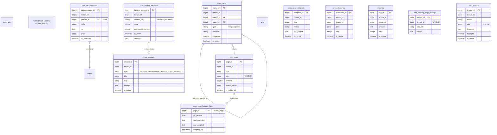
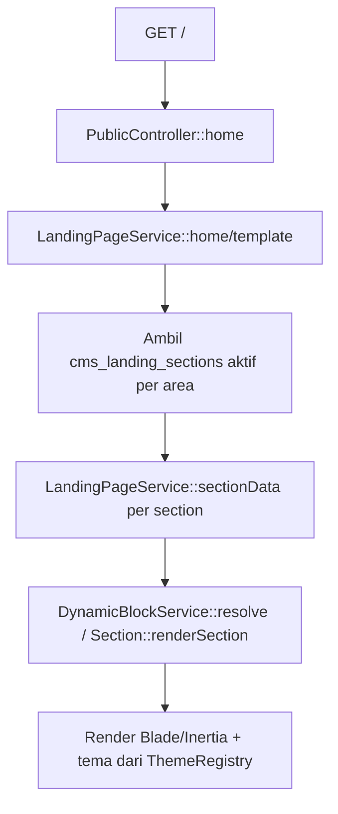

# Public — Domain

Modul **Public** (CMS Landing Page) adalah modul platform yang mengelola konten publik institusi: halaman statis dinamis (`cms_page`), website builder berbasis GrapesJS (`cms_page_builder_data` / `cms_page_templates`), menu navigasi publik (`cms_menu`), pengumuman & berita (`cms_pengumuman`), slideshow, FAQ, serta kumpulan *section* landing (hero, fitur, produk, klien, mitra, testimoni, CTA, statistik, pricing) yang kini disatukan dalam satu tabel kanonis `cms_sections` bertipe diskriminator. Modul ini berinteraksi dengan **Account** untuk identitas penulis pengumuman dan menyajikan tampilan publik (route tanpa prefix) serta area administrasi CMS (prefix `/cms`).

## Identitas & Metadata

| Field | Value |
|-------|-------|
| name | `Public` |
| alias | `public` |
| route_prefix | `cms` |
| portal.group | `platform` |
| portal.priority | `45` |
| portal.icon | `world-www` |
| portal.status | `ready` |
| portal.route | `cms.dashboard` |
| portal.description | Landing page, CMS, and external layout |
| requires | `Account` |
| priority (module load) | `30` |
| DB connection | default (setiap tabel memiliki `tenant_id` default `1`, di-index) |

## Dependencies

- **Modul yang dibutuhkan:** `Account` — `cms_pengumuman.penulis_id` → `users.id` (penulis pengumuman/berita).
- **Modul yang bergantung padanya:** modul lain dapat menampilkan konten publik melalui route web `PublicController` (`/`, `/page/{slug}`, `/announcements`, `/news/{pengumuman}`), namun tidak ada FK lintas-modul ke tabel `cms_*`.
- **Cross-module services / infrastruktur:**
  - `sys_media_url()` (modul Sys) — menyajikan semua aset media (logo, favicon, gambar section, cover pengumuman, slideshow) tanpa symlink public.
  - Konfigurasi di-merge di `PublicServiceProvider::boot()`: `landing_sections`, `public_themes` (`themes`), `builder_sections`, `builder_templates`, `builder_theme`.
  - `logActivity()` tidak digunakan secara masif; audit mengandalkan Sys `sys_activity_log` untuk aksi admin.

## Daftar Tabel & Model

| # | Tabel | Model | Connection | Key columns / description |
|---|-------|-------|------------|---------------------------|
| 1 | `cms_page` | `Page` | default | `page_id` PK, `tenant_id`, `title`, `slug` unique, `content` longText nullable, `render_mode` (custom/template), `template_key`, `meta_desc`, `meta_keywords`, `seo_title`, `pretitle_color`/`title_color`/`subtitle_color`, `is_published` bool. Memiliki `builderData()` (hasOne). Soft delete + blameable. |
| 2 | `cms_page_builder_data` | `BuilderPageData` | default | `page_id` PK (FK → `cms_page`), `gjs_project` JSON (struktur GrapesJS), `html_compiled`, `css_compiled`, `compiled_at`. Menyimpan hasil builder bebas (render_mode = custom). |
| 3 | `cms_page_templates` | `BuilderTemplate` | default | `template_id` PK, `tenant_id`, `key`, `name`, `description`, `thumbnail_url`, `category`, `gjs_project` JSON, `is_active`, `sort_order`. Template GrapesJS yang dapat dipakai ulang. |
| 4 | `cms_menu` | `Menu` | default | `menu_id` PK, `tenant_id`, `parent_id` FK → `cms_menu` sendiri (nullable, hierarki), `title`, `type` (`link`\|`page`\|`route`), `url`, `route`, `page_id` FK → `cms_page` set null, `position` (`header`/`footer`), `target`, `sequence`, `is_active`. Self-relation `parent`/`children`. Soft delete + blameable. |
| 5 | `cms_pengumuman` | `Pengumuman` | default | `pengumuman_id` PK, `tenant_id`, `penulis_id` FK → `users`, `judul`, `isi` text, `jenis` (pengumuman/berita), `is_published` bool, `image_url`, `published_at`, `pretitle_color`/`title_color`/`subtitle_color`. Memiliki koleksi media `cover` & `attachments`. Soft delete + blameable. |
| 6 | `cms_slideshow` | `Slideshow` | default | `slideshow_id` PK, `tenant_id`, `image_url`, `title`, `caption`, `link`, `seq`, `is_active`. Koleksi media `slideshow_image`. Soft delete + blameable. |
| 7 | `cms_faq` | `FAQ` | default | `faq_id` PK, `tenant_id`, `question`, `answer` text, `category` nullable, `seq`, `is_active`. Soft delete + blameable. |
| 8 | `cms_hero_sections` | — (tanpa model Eloquent dedicate; dikelola via `LandingPageSetting`/config) | default | `hero_id` PK, `tenant_id`, `title`, `subtitle`, `description`, `button_primary_text/link`, `button_secondary_text/link`, `is_active`. Data awal landing hero. |
| 9 | `cms_landing_page_settings` | `LandingPageSetting` | default | `setting_id` PK, `tenant_id` unique, `site_title`, `site_description`, `meta_title/description/keywords`, `contact_email/phone`, `whatsapp`, `address`, sosmed (`facebook_url`, `instagram_url`, `linkedin_url`, `youtube_url`), `design` JSON. Koleksi media `logo`, `favicon`. |
| 10 | `cms_landing_sections` | `LandingSection` | default | `landing_section_id` PK, `tenant_id`, `section_key` (50) unique per tenant, `section_name`, `area` (20), `component_name` (80), `variant` (50), `title`/`pre_title`/`post_title`/`subtitle`/`description`, `sort_order`, `limit_data` smallInt, `is_active`, `settings` JSON. Koleksi media `section_image`. Soft delete pattern + blameable id. |
| 11 | `cms_sections` | `Section` | default | `section_id` PK, `tenant_id`, **`type`** diskriminator (`feature`\|`product`\|`client`\|`partner`\|`testimonial`\|`cta`\|`statistic` + juga `slideshow`/`pricing`/`faq` sebagai katalog), `title`, `slug` nullable, `description`, `icon`, `sort_order`, `settings` JSON (fleksibel per type), `is_active`. Unique(`tenant_id`, `type`, `slug`). Tabel **kanonis** pengganti tabel per-type (lihat Catatan Domain). |
| 12 | `cms_pricing` | `Pricing` | default | `pricing_id` PK, `tenant_id`, `name` (100), `slug` unique (120), `description`, `price` (50), `period` nullable, `features` JSON, `highlight` bool, `sort_order`, `is_active`. Soft delete + blameable id. |

> **Konsolidasi (penting):** tabel `cms_features`, `cms_products`, `cms_clients`, `cms_partner`, `cms_testimonial`, `cms_ctas`, dan `cms_statistics` telah **dikonsolidasi** ke dalam `cms_sections` (migrasi `2026_08_23_000002`–`000004`) dan secara fisik **di-drop**. Model legacy (`Feature`, `Product`, `Client`, `Partner`, `Testimonial`, `Cta`, `Statistic`) masih ada di kode namun harus dianggap *deprecated*; penyimpanan kanonis kini pada `cms_sections` (model `Section`).

## Entity Relationship Diagram



> Tidak ada view database. Relasi polimorfis tidak digunakan; `cms_menu.page_id` dan `cms_pengumuman.penulis_id` adalah FK eksplisit. `cms_sections` tidak memiliki FK ke tabel lain (diskriminator `type` + `settings` JSON).

## Relasi ke Modul Lain

- `cms_pengumuman.penulis_id` → `users.id` (Account) — penulis pengumuman/berita.
- `cms_menu.page_id` → `cms_page.page_id` (internal) — menu bertipe `page` menunjuk ke halaman.
- **Tenant scoping:** seluruh tabel `cms_*` membawa `tenant_id` (default `1`); `cms_landing_page_settings` unik per tenant, `cms_landing_sections.section_key` & `cms_sections(type,slug)` unik per tenant.

## Arsitektur & Services

Struktur direktori:

```
Modules/Public/
├── app/
│   ├── Console/Commands/      (jika ada command spesifik)
│   ├── Http/Controllers/Cms/  (Dashboard, Section, Feature, Product, Client, Cta, FAQ, Pengumuman, PublicMenu, Slideshow, Testimonial, Partner, Pricing, PublicPage, LandingPageSetting, BuilderPage, SectionControllerUnified)
│   ├── Http/Controllers/Web/  (PublicController, BuilderPublicController — area publik)
│   ├── Models/                (Page, BuilderPageData, BuilderTemplate, Menu, Pengumuman, Slideshow, FAQ, LandingPageSetting, LandingSection, Section, Pricing, + legacy Feature/Product/Client/Partner/Testimonial/Cta/Statistic)
│   ├── Services/              (BuilderPageService, BuilderSanitizeService, DynamicBlockService, FAQService, LandingPageService, PageService, PengumumanService, PublicMenuService, SlideshowService, ThemeRegistry)
│   ├── Traits/                (helper render)
│   └── Providers/PublicServiceProvider
├── config/                    (landing_sections.php, themes.php, builder_sections.php, builder_templates.php, builder_theme.php)
├── resources/views/          (pages cms/*, builder, komponen sections)
└── routes/web.php            (prefix /cms admin + route publik tanpa prefix)
```

**Fat services** (semua logic bisnis, transaksi, sanitasi):

- `BuilderPageService` — inti website builder GrapesJS: `templateCatalog()`, `createCustomPage()`, `saveProject()` (simpan `gjs_project` + `html_compiled`/`css_compiled`), `cssFromProject()`/`htmlFromProject()`, `editorPayload()`, `themeCss()`, `sectionBlocks()`, `renderSection()`, `publish()`/`unpublish()`, `deletePage()`.
- `BuilderSanitizeService` — keamanan: sanitasi HTML/CSS/project via HTMLPurifier (subclass `BuilderModernCssDef`, `DataImageURIFilter`, `BuilderDataURIScheme`) sebelum disimpan/di-render.
- `LandingPageService` — render landing: `template()`, `saveTemplate()`, `design()`, `saveDesign()`, `home()`/`shared()`/`page()`/`news()`/`newsIndex()`, `sectionOrder()`/`sections()`/`sectionData()`, `initializeSections()`.
- `ThemeRegistry` — registri tema (`all()`, `keys()`, `get()`, `isValid()`, `default()`, `categories()`) dari config `public_themes`.
- `PageService`, `PengumumanService`, `FAQService`, `SlideshowService`, `PublicMenuService` — CRUD + `getFilteredQuery()` (DataTables) + reorder per entitas. `PublicMenuService` mendukung `reorderMenus()` (hierarki) & `reorderForPosition()`.
- `DynamicBlockService` — `resolve()` (render blok dinamis dari `cms_sections`), `clearCache()`.

**Key classes/interfaces:** `Section` (model kanonis dengan konstanta `TYPE_*`, `TYPES`, `TYPE_ICONS`), `LandingSection::defaultRows()` (seed section default), `PublicController`/`BuilderPublicController` (area publik via Inertia), `BaseModuleServiceProvider` (menu). **Thin controller:** controller hanya memanggil service & mengembalikan response; tidak ada query model langsung.

## Alur Bisnis / Domain Flows

### Render halaman publik (landing)



### Website Builder (GrapesJS)

```mermaid
flowchart TD
    U[Editor builder] --> S[saveProject: gjs_project + html/css]
    S --> SAN[BuilderSanitizeService::sanitizeProject/Html/Css]
    SAN --> ST[(cms_page_builder_data)}
    ST --> P[publish → is_published=true]
    P --> V[BuilderPublicController::show /{slug}]
```

### Manajemen Section (konsolidasi)

Section dikelola lewat `SectionController` (per-type legacy, redirect) dan `SectionControllerUnified` (CRUD `cms_sections` berdasarkan `type` diskriminator) dengan toggle `is_active` & reorder `sort_order`. Pengumuman memiliki turunan "Berita" (`jenis=berita`) lewat route `/cms/berita`.

## Catatan Domain

- **Konsolidasi section:** `cms_sections` adalah tabel kanonis pengganti 7 tabel per-type. Field `type` menentukan bentuk `settings` JSON (product: short_description/demo_url; client: website; partner: category/website_url; testimonial: position/organization/rating; cta: button_text/link; statistic: value). Migrasi `2026_08_23_000003` memindahkan data lama ke `cms_sections`; `000004` menghapus tabel lama. Model legacy (`Feature`, `Product`, dll.) masih ada namun *deprecated*.
- **Dua area route:** area admin CMS di prefix `/cms` (middleware `auth`, `check.expired`, `module:public`); area publik di root (`/`, `/page/{slug}`, `/announcements`, `/news/{pengumuman}`, `/{slug}` builder) tanpa auth, di-render via `HandleInertiaRequests`.
- **Backward-compat redirects:** `cms/landing*`, `cms/media-social`, `cms/seo` di-redirect ke `cms/section` / `cms/settings`.
- **Keamanan media:** semua aset (logo, favicon, section image, cover pengumuman, slideshow, dll.) disajikan via `sys_media_url()` — **tidak ada** symlink public storage. Koleksi media di-register per model (`logo`, `favicon`, `section_image`, `cover`, `attachments`, `slideshow_image`, dll.) dengan konversi ukuran (thumb/card/bg/logo).
- **Sanitasi builder:** HTML/CSS dari GrapesJS selalu melewati `BuilderSanitizeService` (HTMLPurifier) untuk mencegah XSS sebelum disimpan ke `cms_page_builder_data` dan saat di-render.
- **RBAC:** permission `public.cms.view` (Daftar Halaman/CMS Sections), `public.builder.view` (Website Builder), `public.cms.settings.view` (Kontak & SEO). Menu modul didefinisikan di `PublicServiceProvider::menu()`.
- **Config-driven:** tema, daftar section, template, dan theme builder di-load dari `config/landing_sections.php`, `config/themes.php`, `config/builder_sections.php`, `config/builder_templates.php`, `config/builder_theme.php` (di-merge di boot provider).
- **Soft delete + blameable:** sebagian besar tabel `cms_*` menggunakan `SoftDeletes` + kolom blameable (`created_by`/`updated_by`/`deleted_by` + `*_id`) dan trait `BelongsToTenant`/`HashidBinding`. `cms_sections` REVISI terakhir menambahkan `design` (JSON) ke `cms_landing_page_settings` dan `icon` ke `cms_products` (pra-konsolidasi).
