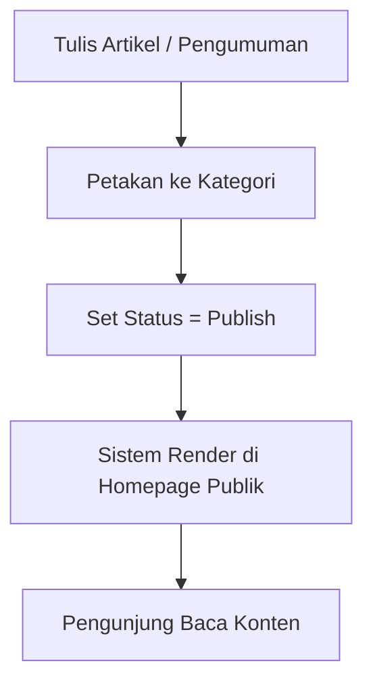
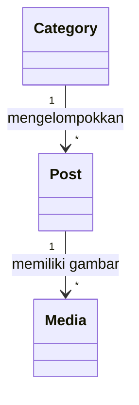
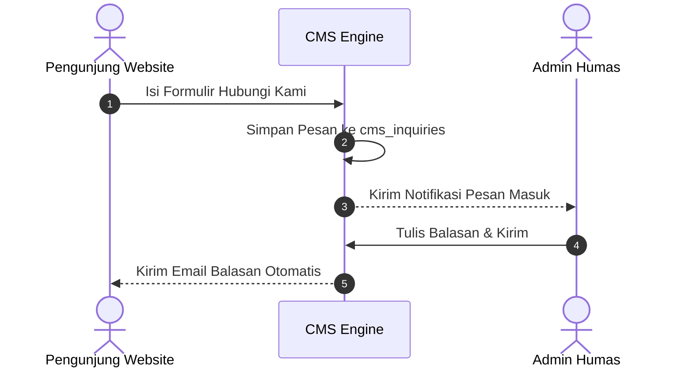

# DOMAIN Spec — Modul Public (CMS)

Module: Public | Prefix DB: `cms_` | Route prefix: `cms` | Permission prefix: `cms`

## 1. Tujuan Modul
Mengelola website portal luar perguruan tinggi, termasuk pengelolaan artikel berita, pengumuman, halaman statis prodi, banner dinamis, serta formulir hubungi kami.

## 2. Diagram Alur & Relasi

### 2.1 Alur Publikasi Konten

### 2.2 Relasi Tabel

## 2. Entitas & Tabel (Auto-Generated)

#### `cms_page`

| Kolom | Tipe | Keterangan |
| --- | --- | --- |
| `page_id` | `id` | |
| `tenant_id` | `unsignedBigInteger` | |
| `title` | `string` | |
| `slug` | `string` | |
| `content` | `longText` | |
| `meta_desc` | `text` | |
| `meta_keywords` | `text` | |
| `is_published` | `boolean` | |
| `created_by` | `string` | |
| `updated_by` | `string` | |
| `deleted_by` | `string` | |
| `created_at` | `timestamp` | |
| `updated_at` | `timestamp` | |
| `deleted_at` | `timestamp` | |

#### `cms_menu`

| Kolom | Tipe | Keterangan |
| --- | --- | --- |
| `menu_id` | `id` | |
| `tenant_id` | `unsignedBigInteger` | |
| `parent_id` | `unsignedBigInteger` | |
| `title` | `string` | |
| `type` | `string` | |
| `url` | `string` | |
| `route` | `string` | |
| `page_id` | `unsignedBigInteger` | |
| `position` | `string` | |
| `target` | `string` | |
| `sequence` | `integer` | |
| `is_active` | `boolean` | |
| `created_by` | `string` | |
| `updated_by` | `string` | |
| `deleted_by` | `string` | |
| `parent_id` | `foreign` | |
| `page_id` | `foreign` | |
| `created_at` | `timestamp` | |
| `updated_at` | `timestamp` | |
| `deleted_at` | `timestamp` | |

#### `cms_pengumuman`

| Kolom | Tipe | Keterangan |
| --- | --- | --- |
| `pengumuman_id` | `id` | |
| `tenant_id` | `unsignedBigInteger` | |
| `penulis_id` | `unsignedBigInteger` | |
| `judul` | `string` | |
| `isi` | `text` | |
| `jenis` | `string` | |
| `is_published` | `boolean` | |
| `image_url` | `string` | |
| `published_at` | `timestamp` | |
| `created_by` | `string` | |
| `updated_by` | `string` | |
| `deleted_by` | `string` | |
| `penulis_id` | `foreign` | |
| `created_at` | `timestamp` | |
| `updated_at` | `timestamp` | |
| `deleted_at` | `timestamp` | |

#### `cms_slideshow`

| Kolom | Tipe | Keterangan |
| --- | --- | --- |
| `tenant_id` | `unsignedBigInteger` | |
| `image_url` | `string` | |
| `title` | `string` | |
| `caption` | `string` | |
| `link` | `string` | |
| `seq` | `integer` | |
| `is_active` | `boolean` | |
| `created_by` | `string` | |
| `updated_by` | `string` | |
| `deleted_by` | `string` | |
| `id` | `id` | |
| `created_at` | `timestamp` | |
| `updated_at` | `timestamp` | |
| `deleted_at` | `timestamp` | |

#### `cms_faq`

| Kolom | Tipe | Keterangan |
| --- | --- | --- |
| `faq_id` | `id` | |
| `tenant_id` | `unsignedBigInteger` | |
| `question` | `string` | |
| `answer` | `text` | |
| `category` | `string` | |
| `seq` | `integer` | |
| `is_active` | `boolean` | |
| `created_by` | `string` | |
| `updated_by` | `string` | |
| `deleted_by` | `string` | |
| `created_at` | `timestamp` | |
| `updated_at` | `timestamp` | |
| `deleted_at` | `timestamp` | |

#### `cms_testimonial`

| Kolom | Tipe | Keterangan |
| --- | --- | --- |
| `testimonial_id` | `id` | |
| `tenant_id` | `unsignedBigInteger` | |
| `name` | `string` | |
| `position` | `string` | |
| `organization` | `string` | |
| `quote` | `text` | |
| `rating` | `unsignedTinyInteger` | |
| `seq` | `unsignedInteger` | |
| `is_active` | `boolean` | |
| `created_by` | `string` | |
| `updated_by` | `string` | |
| `deleted_by` | `string` | |
| `created_at` | `timestamp` | |
| `updated_at` | `timestamp` | |
| `deleted_at` | `timestamp` | |

#### `cms_partner`

| Kolom | Tipe | Keterangan |
| --- | --- | --- |
| `partner_id` | `id` | |
| `tenant_id` | `unsignedBigInteger` | |
| `name` | `string` | |
| `category` | `string` | |
| `website_url` | `string` | |
| `seq` | `unsignedInteger` | |
| `is_active` | `boolean` | |
| `created_by` | `string` | |
| `updated_by` | `string` | |
| `deleted_by` | `string` | |
| `created_at` | `timestamp` | |
| `updated_at` | `timestamp` | |
| `deleted_at` | `timestamp` | |

#### `cms_hero_sections`

| Kolom | Tipe | Keterangan |
| --- | --- | --- |
| `hero_id` | `id` | |
| `tenant_id` | `unsignedBigInteger` | |
| `title` | `string` | |
| `subtitle` | `string` | |
| `description` | `text` | |
| `button_primary_text` | `string` | |
| `button_primary_link` | `string` | |
| `button_secondary_text` | `string` | |
| `button_secondary_link` | `string` | |
| `is_active` | `boolean` | |
| `created_by` | `string` | |
| `created_by_id` | `unsignedBigInteger` | |
| `updated_by` | `string` | |
| `updated_by_id` | `unsignedBigInteger` | |
| `deleted_by` | `string` | |
| `deleted_by_id` | `unsignedBigInteger` | |
| `created_at` | `timestamp` | |
| `updated_at` | `timestamp` | |
| `deleted_at` | `timestamp` | |

#### `cms_features`

| Kolom | Tipe | Keterangan |
| --- | --- | --- |
| `feature_id` | `id` | |
| `tenant_id` | `unsignedBigInteger` | |
| `title` | `string` | |
| `description` | `text` | |
| `icon` | `string` | |
| `sort_order` | `unsignedInteger` | |
| `is_active` | `boolean` | |
| `created_by` | `string` | |
| `created_by_id` | `unsignedBigInteger` | |
| `updated_by` | `string` | |
| `updated_by_id` | `unsignedBigInteger` | |
| `deleted_by` | `string` | |
| `deleted_by_id` | `unsignedBigInteger` | |
| `created_at` | `timestamp` | |
| `updated_at` | `timestamp` | |
| `deleted_at` | `timestamp` | |

#### `cms_products`

| Kolom | Tipe | Keterangan |
| --- | --- | --- |
| `product_id` | `id` | |
| `tenant_id` | `unsignedBigInteger` | |
| `name` | `string` | |
| `slug` | `string` | |
| `short_description` | `string` | |
| `description` | `text` | |
| `demo_url` | `string` | |
| `sort_order` | `unsignedInteger` | |
| `is_active` | `boolean` | |
| `created_by` | `string` | |
| `created_by_id` | `unsignedBigInteger` | |
| `updated_by` | `string` | |
| `updated_by_id` | `unsignedBigInteger` | |
| `deleted_by` | `string` | |
| `deleted_by_id` | `unsignedBigInteger` | |
| `created_at` | `timestamp` | |
| `updated_at` | `timestamp` | |
| `deleted_at` | `timestamp` | |

#### `cms_statistics`

| Kolom | Tipe | Keterangan |
| --- | --- | --- |
| `statistic_id` | `id` | |
| `tenant_id` | `unsignedBigInteger` | |
| `label` | `string` | |
| `value` | `string` | |
| `icon` | `string` | |
| `sort_order` | `unsignedInteger` | |
| `is_active` | `boolean` | |
| `created_by` | `string` | |
| `created_by_id` | `unsignedBigInteger` | |
| `updated_by` | `string` | |
| `updated_by_id` | `unsignedBigInteger` | |
| `deleted_by` | `string` | |
| `deleted_by_id` | `unsignedBigInteger` | |
| `created_at` | `timestamp` | |
| `updated_at` | `timestamp` | |
| `deleted_at` | `timestamp` | |

#### `cms_clients`

| Kolom | Tipe | Keterangan |
| --- | --- | --- |
| `client_id` | `id` | |
| `tenant_id` | `unsignedBigInteger` | |
| `name` | `string` | |
| `website` | `string` | |
| `sort_order` | `unsignedInteger` | |
| `is_active` | `boolean` | |
| `created_by` | `string` | |
| `created_by_id` | `unsignedBigInteger` | |
| `updated_by` | `string` | |
| `updated_by_id` | `unsignedBigInteger` | |
| `deleted_by` | `string` | |
| `deleted_by_id` | `unsignedBigInteger` | |
| `created_at` | `timestamp` | |
| `updated_at` | `timestamp` | |
| `deleted_at` | `timestamp` | |

#### `cms_ctas`

| Kolom | Tipe | Keterangan |
| --- | --- | --- |
| `cta_id` | `id` | |
| `tenant_id` | `unsignedBigInteger` | |
| `title` | `string` | |
| `description` | `text` | |
| `button_text` | `string` | |
| `button_link` | `string` | |
| `is_active` | `boolean` | |
| `created_by` | `string` | |
| `created_by_id` | `unsignedBigInteger` | |
| `updated_by` | `string` | |
| `updated_by_id` | `unsignedBigInteger` | |
| `deleted_by` | `string` | |
| `deleted_by_id` | `unsignedBigInteger` | |
| `created_at` | `timestamp` | |
| `updated_at` | `timestamp` | |
| `deleted_at` | `timestamp` | |

#### `cms_landing_page_settings`

| Kolom | Tipe | Keterangan |
| --- | --- | --- |
| `tenant_id` | `unsignedBigInteger` | |
| `site_title` | `string` | |
| `site_description` | `text` | |
| `meta_title` | `string` | |
| `meta_description` | `text` | |
| `meta_keywords` | `text` | |
| `contact_email` | `string` | |
| `contact_phone` | `string` | |
| `whatsapp` | `string` | |
| `address` | `text` | |
| `facebook_url` | `string` | |
| `instagram_url` | `string` | |
| `linkedin_url` | `string` | |
| `youtube_url` | `string` | |
| `created_by` | `string` | |
| `created_by_id` | `unsignedBigInteger` | |
| `updated_by` | `string` | |
| `updated_by_id` | `unsignedBigInteger` | |
| `id` | `id` | |
| `created_at` | `timestamp` | |
| `updated_at` | `timestamp` | |

#### `cms_landing_sections`

| Kolom | Tipe | Keterangan |
| --- | --- | --- |
| `landing_section_id` | `id` | |
| `tenant_id` | `unsignedBigInteger` | |
| `section_key` | `string` | |
| `section_name` | `string` | |
| `area` | `string` | |
| `component_name` | `string` | |
| `variant` | `string` | |
| `title` | `string` | |
| `pre_title` | `string` | |
| `post_title` | `string` | |
| `subtitle` | `string` | |
| `description` | `text` | |
| `sort_order` | `unsignedInteger` | |
| `limit_data` | `unsignedSmallInteger` | |
| `is_active` | `boolean` | |
| `settings` | `json` | |
| `created_by` | `string` | |
| `created_by_id` | `unsignedBigInteger` | |
| `updated_by` | `string` | |
| `updated_by_id` | `unsignedBigInteger` | |
| `created_at` | `timestamp` | |
| `updated_at` | `timestamp` | |

## 3. Diagram Urutan Pengiriman Kontak Publik

## 5. Aturan Bisnis
1.  Formulir hubungi kami dilindungi oleh Captcha untuk mencegah serangan spamming bot.